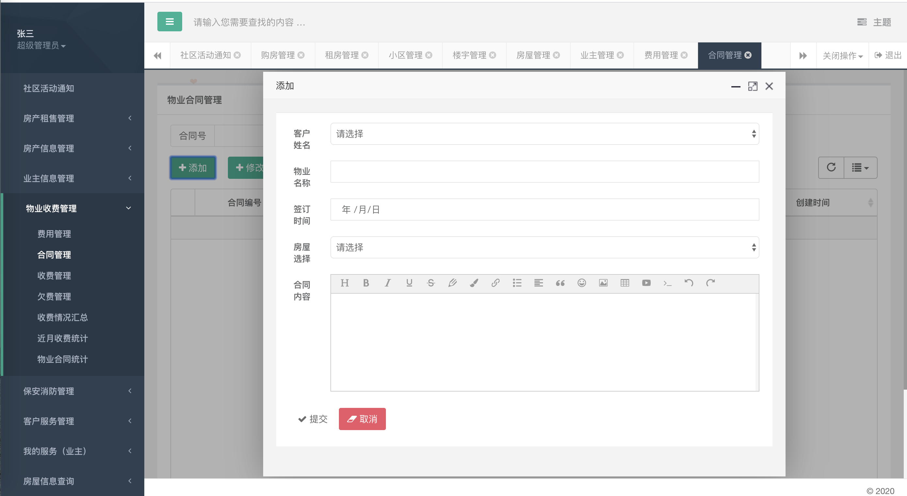

# 社区物业小区后勤维护系统的设计

题目描述：对于小区物业管理来说，其工作流程的繁杂性、多样化、管理复杂、收缴费用与设备维护繁琐。计算机已完全能够胜任物业管理工作，而且更加准确、方便、快捷、高效、清晰、透明，它完全可以克服以上所述的不足之处。这将给项目查询和管理带来很大的方便，从而给物业管理工作带来更高的效率，这也是物业管理正规化、现代化的重要标志。为了对小区物业进行管理。现设计系统完成以下功能：

(1)房产信息管理：记录管理区、大楼、楼层、房间及配套硬件设施的基本信息。主要项目：小区基本信息管理、楼宇基本信息管理、房间管理信息管理，以方便随时核查资产情况，方便追踪。

(2)业主信息管理：实现对业主购房、出租、退房的全过程管理，可以随时查询住户历史情况和现状，加强对业主及住户的沟通和管理。包括业主信息管理、业主家庭成员、车辆信息、电话信息、宠物信息、报修历史等信息。

(3)收费管理：物业收费管理模块是整个小区物业管理系统的日常业务管理模块，对物业管理公司的经营管理工作起到至关重要的作用。在收费管理中，系统可以记录每个户主缴费记录。主要功能：收费项目定义、合同管理、应收款管理、实收、欠费管理、收费情况统计查询。这样可以方便费用的核算，以及欠款户主的催缴工作。

(4)保安消防管理：消防保安管理是企业正常运转的重要保证。本模块主要包括保安人员档案管理、保安人员定岗、轮班或换班管理、安防巡逻检查记录、治安情况记录以及来人来访、物品出入管理等功能。

(5)客户服务管理：客户投诉管理、报修管理，可以让客户在线报修，投诉，并在线查看处理进度，及时反馈、社区活动。

### 功能：

#### 房产信息管理

小区信息-小区是唯一的不支持删除和新增（小区表：名称，位置，描述，占地大小，建成日期，居住人口，绿化面积）

楼宇信息（楼宇表：楼号，层数，单元数，面积，位置，房屋数）

房屋信息（待租，待售，已租，已售 房产信息表：区域，楼号，房间号，状态，大小，位置，租金）

#### 业主信息管理

业主信息（用户表和业主表关联 业主表：工作单位，工作地址，居住地址，入住日期，家庭成员数量、车辆、电话、宠物，备注）添加的用户，用户名为邮箱，密码统一为“123456”，修改仅支持修改业主信息

#### 房产租售管理

购房管理（使用一张表：业主+房屋+购买/住房日期）同时改变房屋状态

租房管理 

收费信息管理（缴费按照年度制查询，需要有专门的缴费表）

//费用的计算是累积全部费用，每次加载都要重新计算

//在缴纳本年度的物业费后，再增加的物业费用将不计算

费用管理 （费用表：名称 ，用途，费用，描述，加入日期）

合同管理（包括购房和住房）自动生成的，包含合同编号和累积缴纳金额

收费管理（按照年度查找，包括两类：已收，欠费）

收费统计（已经收费总额，欠收费总额，缴纳户数，未缴纳户数）

（缴费记录表：按照有合同的业主来查找，可能存在某年合同不在的问题，所以在缴费表里添加进去必要信息，不必再去合同或业主表查找）

#### 保安消防管理 

人员档案 属于用户模块表，不再单独建立

排班管理 （表 ：原值班人姓名，换班人姓名，班次，日期，区域，备注）

巡查管理 （表：姓名，区域，日期，问题记录，紧急程度，备注）

治安管理（表：姓名，区域，日期，问题记录，紧急程度，备注）

来访管理 （表：访客姓名，被访问人姓名，地址，手机号，日期，预计时长，备注）

物品管理（表：司机，电话，物品名称，车牌号，出入日期）

#### 客户服务管理

个人信息

投诉管理
非管理员只能看自己的记录，管理员可以看所有人的记录，以角色id-8为查询字段

报修管理

非管理员只能看自己的记录，管理员可以看所有人的记录，以角色id-8为查询字段

社区活动（通知管理）

系统设置管理

### 涉及技术

Springboot
beetl模板引擎
mybatis框架
tkmybatis框架
apache shiro
Aop切面编程
hutool

#### 包结构

在日常开发中，业务模块的包结构划分一般划分为四 个 common 、 config 、 core 、 modular 

Common 为模块内通用的注解、常量、枚举、异常和持久化的实体等

Config 包存放整个模块的配置类，因为项目基于spring boot开发，大部分的spring配置都换 成了java bean方式的配置，所以单独分一个包来存放配置， config 包中除了存放配置类，还有一些以 Properties 结尾的类，这些类的作用是启动应用的时候把 application.yml 中的配置映射到类的属性上。

Modular 存放按业务划分的业务代码，若本模块中包含多个模块业务，则在 modular 中建立多个业务包，在具体的业务包下再建立 controller 、 dao 、 service 、 transfer 、 warpper 这几个包，其中 transfer 为前后端传输数据所用的属性封装， warpper 为对返回结果的包装器(下面会介绍到)，如果当前模块 中只存在一类业务，那么没有必要在 modular 包下再建立多个业务模块，可直接在 modular 模块建立 controller 、 dao 、 service 、 transfer 、 warpper 。

## 有需要请加QQ：641351484

